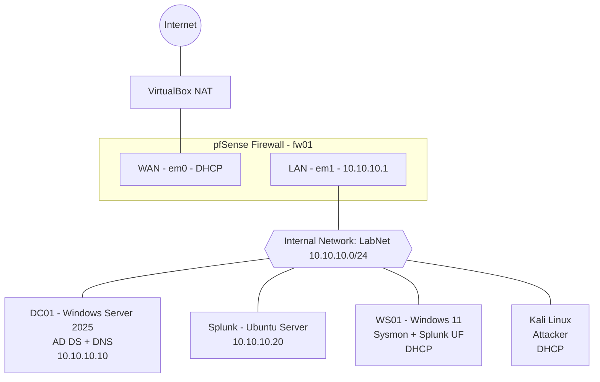

# 🛡️ SOC Homelab

A virtualized cybersecurity lab built on a single desktop to develop hands-on **SOC Analyst** skills: deploying a SIEM, collecting endpoint telemetry, simulating attacks, and building detections.

This repo documents every step of the build, including the problems I hit and how I fixed them.

---

## 🎯 Goals

- Build a realistic small-business network with a firewall, Active Directory domain, and endpoints
- Centralize Windows and Sysmon logs in **Splunk**
- Simulate attacks from **Kali Linux** and investigate them the way a Level 1 SOC analyst would
- Write detections and document each investigation (attack → logs → detection)

---

## 🗺️ Network Architecture

| Host | Role | OS | IP Address |
|------|------|----|------------|
| fw01 | Firewall / Router / DHCP | pfSense CE 2.9.0 | 10.10.10.1 |
| DC01 | Domain Controller / DNS | Windows Server 2025 (Eval) | 10.10.10.10 |
| SPLUNK01 | SIEM | Ubuntu Server | 10.10.10.20 |
| WS01 | Domain Workstation | Windows 11 Enterprise (Eval) | DHCP (.100–.200) |
| Kali | Attacker | Kali Linux | DHCP (.100–.200) |

**Domain:** `lab.local`

---

## 💻 Host Hardware

- **CPU:** 12 cores
- **RAM:** 64 GB DDR4
- **Storage:** Multi-TB
- **Hypervisor:** Oracle VirtualBox

---

## 📋 Build Progress

### Phase 1: Core Lab
- [x] [Step 1: pfSense Firewall](docs/01-pfsense-firewall.md)
- [x] [Step 2: Windows Server Domain Controller](docs/02-windows-server-dc.md)
- [ ] Step 3: Ubuntu Server + Splunk SIEM
- [ ] Step 4: Windows 11 Workstation + Sysmon + Splunk Universal Forwarder
- [ ] Step 5: Kali Linux Attacker
- [ ] Step 6: End-to-end validation (logs flowing into Splunk)

### Phase 2: Expanding the Lab
- [ ] Network monitoring with Suricata / Zeek (or Security Onion)
- [ ] Vulnerable target (Metasploitable / DVWA)
- [ ] Case management (TheHive)

### Investigations & Detections
_Coming soon: attack simulations, Splunk searches, and detection write-ups._

---

## 🧰 Tools & Technologies

pfSense · Windows Server 2025 · Active Directory · DNS · DHCP · VirtualBox · Splunk · Sysmon · Kali Linux · Ubuntu Server

---

## 💰 Cost

**$0.** Every component uses free, community, or evaluation licensing.
